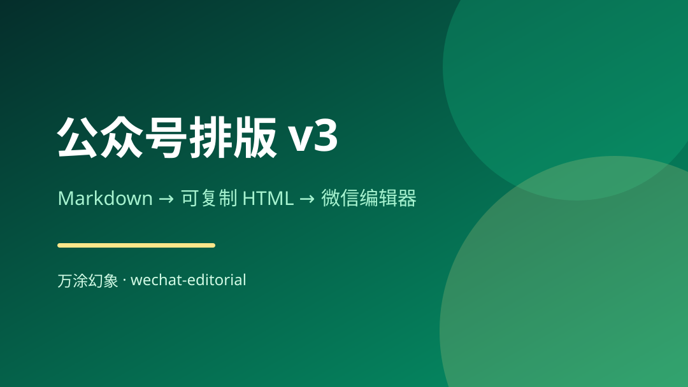

# wechat-editorial

万涂幻象正在使用的微信公众号排版 Agent Skill，当前公开版为 v3。

把 Markdown 或 Obsidian 文章转换成可直接复制到微信公众号编辑器的 HTML，支持本地图片 base64 内嵌、封面卡、章节头、三层重点标记、深色代码块、品牌 PNG + GIF 尾卡，以及生成后的确定性合规校验。



## 主要能力

- Markdown 和 Obsidian wikilink 图片解析
- 图片 base64 内嵌，复制正文时图片一起进入公众号
- 翠绿卡片风、极简大数字章节头、黄色高亮与浅绿下划线
- 金句卡、警告框、信息框、列表、引用、表格和深色代码块
- 超长 PNG 滚动容器与 GIF 动图角标
- 可替换的品牌信息条、静态名片和互动 GIF 尾卡
- 自动检查公众号不兼容标签、属性和 CSS
- 零前端依赖，核心排版脚本只使用 Python 标准库

## 安装

### Codex

```bash
git clone https://github.com/xiangruiai/wechat-editorial.git \
  ~/.codex/skills/wechat-editorial
```

### Claude Code

```bash
git clone https://github.com/xiangruiai/wechat-editorial.git \
  ~/.claude/skills/wechat-editorial
```

其他支持 Agent Skills 的工具，可以把整个仓库复制到对应的 skills 目录。

## 快速开始

```bash
cd ~/.codex/skills/wechat-editorial
python3 md_to_editorial.py examples/demo.md --open
```

生成后浏览器会打开预览页。点击右上角“复制到公众号”，再粘贴进公众号编辑器。

如果只要正文，不要封面和品牌尾卡：

```bash
python3 md_to_editorial.py article.md --plain --open
```

## 图片路径

脚本按以下顺序查找图片：

1. 绝对路径
2. Markdown 文件所在目录的相对路径
3. `--image-root` 指定目录
4. `--vault` 指定目录内的同名文件

```bash
python3 md_to_editorial.py article.md \
  --vault "/path/to/obsidian-vault" \
  --image-root "/path/to/article-images" \
  --open
```

也可以使用环境变量：

```bash
export WECHAT_EDITORIAL_VAULT="/path/to/vault"
export WECHAT_EDITORIAL_IMAGE_ROOT="/path/to/images"
```

## 品牌定制

```bash
python3 md_to_editorial.py article.md \
  --brand-name "你的品牌" \
  --tagline "你的品牌语" \
  --footer-card "/path/to/profile-card.png" \
  --footer-actions "/path/to/actions.gif" \
  --open
```

仓库默认保留万涂幻象生产版尾卡，用于完整展示效果。其他账号使用时请替换品牌信息与尾卡资产，不要冒用万涂幻象身份。

重新生成品牌 PNG + GIF 尾卡需要 Pillow：

```bash
python3 -m pip install -r requirements.txt
python3 gen_branded_footer.py /path/to/card-source.png
```

## 手动校验

渲染时会自动调用校验器，也可以单独运行：

```bash
python3 validate_wx_html.py /tmp/wx_preview.html
```

ERROR 必须清零。WARNING 用于人工确认，零 WARNING 不代表排版一定自然。

## 目录

```text
.
├── SKILL.md
├── md_to_editorial.py
├── validate_wx_html.py
├── gen_branded_footer.py
├── assets/
├── references/
├── examples/
├── NOTICE
└── LICENSE
```

## 来源与开源协议

本项目的翠绿主题组件基于 [isjiamu/gzh-design-skill](https://github.com/isjiamu/gzh-design-skill) 的 `theme-moyu-green` 改编。上游采用 AGPL-3.0-or-later，因此本仓库也按 AGPL-3.0-or-later 开源。修改和归属说明见 [NOTICE](NOTICE)，完整协议见 [LICENSE](LICENSE)。

## 关于万涂幻象

**北京万涂幻象科技有限公司**：以自研的 Agent 上下文与主体连续性技术为底座，在上面跑着企业 AI 落地、课程与培训、品牌宣传三条业务。技术不空转，每一次业务交付都是对底座的一次真实验证。

- [公司业务最新介绍（飞书）](https://waytoagi.feishu.cn/wiki/EAJkw9JcviTt3UkjoyXcKkLzn1W)
- [万涂幻象开源工具箱](https://github.com/xiangruiai/vantasma-toolkit)
- 联系：li@xiangruiai.com

## 微信赞赏

项目永久免费使用。如果它帮到了你，欢迎[请祥瑞喝杯咖啡](https://pay.xiangruiai.com/?project=wechat-editorial)，支持后续维护和继续开源。赞赏完全自愿，不解锁任何功能。
